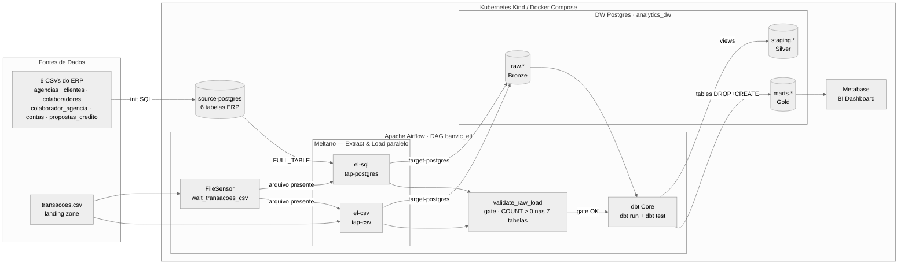
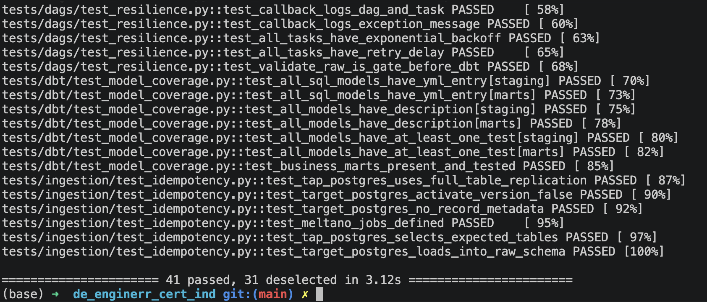
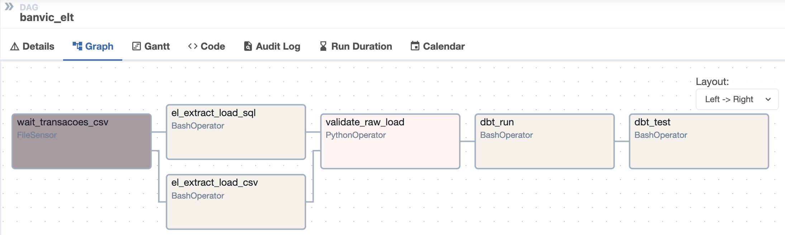
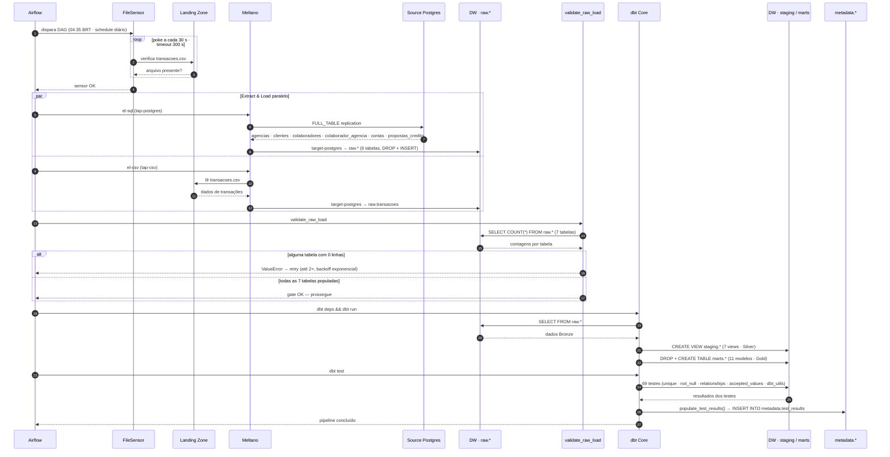
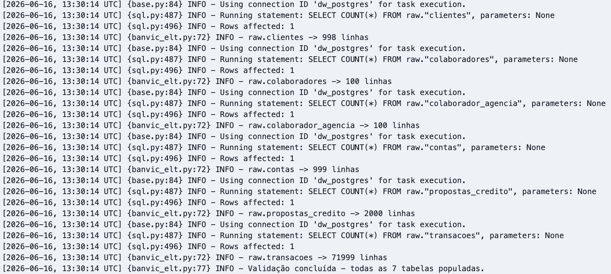
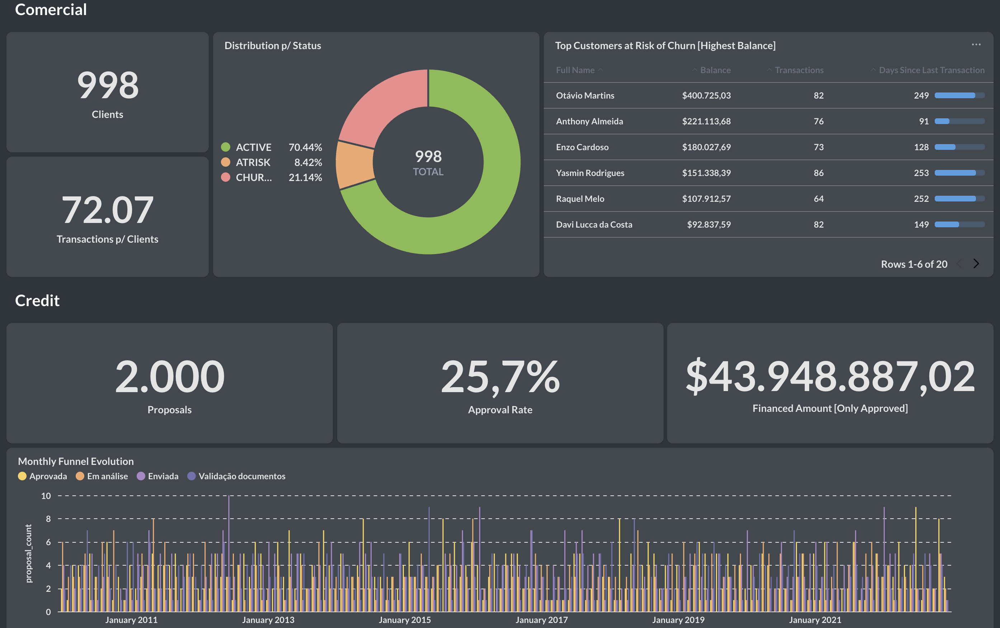

# BanVic ELT Pipeline — Certificação Data Engineer (Indicium)


Pipeline de dados completo para o case **BanVic (Banco Vitória S.A.)**, desenvolvido como entregável da Certificação Data Engineer da Indicium. Cobre toda a stack de um pipeline de dados moderno: ingestão com Meltano (Singer Protocol), orquestração com Apache Airflow, transformação com dbt em arquitetura Medallion e visualização com Metabase — rodando em Docker Compose para desenvolvimento e em Kubernetes com Kind para produção.

---

## Arquitetura



A topologia segue o padrão ELT em três estágios: os dados de origem (ERP relacional + arquivo de transações) são ingeridos via Meltano com replicação `FULL_TABLE` na camada Bronze; o Airflow orquestra todo o fluxo com FileSensor, execução paralela do EL e gate de qualidade antes do dbt; e o dbt transforma Bronze → Silver (views) → Gold (tables), expondo os marts no Metabase. Em produção, a stack inteira roda em Kubernetes (Kind) com KubernetesExecutor — cada task da DAG sobe como um pod isolado.

---

## Pré-requisitos

**Docker Compose (desenvolvimento)**
- Docker Desktop com Docker Compose v2
- `make` (GNU Make)
- Python 3.12 (apenas para gerar o Fernet Key no host)

**Kubernetes / Kind (produção local)**
- Tudo acima, mais: `kind` + `kubectl` + `helm`

---

## Dados de Origem

Os CSVs do case **não estão no repositório** (gitignored). Obtenha-os do repositório
original da certificação e distribua nos dois diretórios abaixo antes de subir qualquer
ambiente:

```bash
# 6 tabelas relacionais do ERP → source-postgres
cp agencias.csv clientes.csv colaboradores.csv \
   colaborador_agencia.csv contas.csv propostas_credito.csv \
   data/source/

# arquivo de transações → landing zone (lido pelo FileSensor + tap-csv)
cp transacoes.csv data/landing/
```

> **Atenção:** `transacoes.csv` vai exclusivamente em `data/landing/`. Os demais 6
> arquivos vão exclusivamente em `data/source/`. Misturar os diretórios causa falha
> no init do source-postgres ou no tap-csv.

---

## Quick Start — Docker Compose

```bash
# 1. Clone o repositório
git clone <repo-url> && cd de_enginerr_cert_ind

# 2. Copie e preencha as variáveis de ambiente
cp .env.example .env
```

Edite `.env` e substitua todos os `changeme` por senhas reais. Gere o Fernet Key do
Airflow com:

```bash
python3 -c "import os, base64; print(base64.urlsafe_b64encode(os.urandom(32)).decode())"
```

Cole o resultado em `AIRFLOW_FERNET_KEY` no `.env`.

```bash
# 3. Coloque os CSVs nos diretórios corretos (ver seção "Dados de Origem" acima)

# 4. Suba o ambiente (faz build + docker compose up -d)
make up
# Aguarde ~2 min para o Airflow terminar de inicializar

# 5. Acesse o Airflow e dispare a DAG
#    http://localhost:8080  (usuário: admin / senha: AIRFLOW_ADMIN_PASSWORD do .env)
#    DAG: banvic_elt → Trigger DAG ▶

# 6. Acompanhe a execução e verifique os dados no DW
docker compose exec dw-postgres psql -U analytics -d analytics_dw \
  -c "SELECT schemaname, relname, n_live_tup
      FROM pg_stat_user_tables
      WHERE schemaname = 'raw'
      ORDER BY relname;"

# 7. Configure o Metabase (primeiro acesso — ver seção abaixo)
#    http://localhost:3000
```

### Configuração inicial do Metabase

O Metabase sobe **sem dashboards nem conexão pré-configurados**. No primeiro acesso siga os passos:

**1. Wizard de setup** (`http://localhost:3000`)
Crie a conta admin (qualquer e-mail/senha) e avance até a tela "Add your data".

**2. Conectar ao Data Warehouse**

| Campo | Valor |
|---|---|
| Database type | PostgreSQL |
| Host | `dw-postgres` |
| Port | `5432` |
| Database name | `analytics_dw` |
| Username | `analytics` |
| Password | senha definida em `DW_POSTGRES_PASSWORD` |

**3. Criar questions com as queries prontas**

As queries de negócio já estão em `queries/`:

| Arquivo | Conteúdo |
|---|---|
| `queries/dashboard_comercial.sql` | KPIs, engajamento/churn e ranking de alavancas (Camila + Sofia/CEO) |
| `queries/dashboard_dash_credito.sql` | Funil de crédito, taxa de aprovação e performance por agência |
| `queries/dashboard_insights.sql` | 5 insights operacionais (anomalias, cross-sell, contas dormentes) |

No Metabase: **New → Question → Native query** → selecione `analytics_dw` → cole o bloco SQL desejado → **Save**.

### Parar o ambiente

```bash
make down   # derruba todos os containers e remove volumes
```

### Atalho — ambiente já configurado

Após ter percorrido o passo a passo acima ao menos uma vez e validado que tudo funciona, use o comando abaixo para subir o ambiente completo de uma só vez:

```bash
make start
```

---

## Quick Start — Kubernetes / Kind

> **Ordem importa:** os CSVs precisam estar em `data/source/` e `data/landing/`
> **antes** de criar o cluster, porque o `kind-cluster.yaml` usa `extraMounts` para
> expor esses diretórios dentro do nó Kind.

> **Execute todos os comandos `make` a partir da raiz do projeto** — os `extraMounts`
> usam caminhos relativos (`./data/source`, `./data/landing`) que dependem do diretório
> de trabalho atual.

```bash
# 1. Copie os CSVs (ver seção "Dados de Origem" acima)
#    data/source/ → 6 arquivos  |  data/landing/ → transacoes.csv

# 2. Crie o cluster Kind (lê extraMounts do kind-cluster.yaml)
make kind-up

# 3. Construa a imagem e carregue no Kind
make kind-load
```

### 4. Gerar k8s/secrets.yaml

> **Requer o `.env` preenchido** (passo 2 do Quick Start Docker Compose).
> O script lê todas as credenciais do `.env`, faz a conversão para base64 e escreve
> `k8s/secrets.yaml` automaticamente — sem copiar nem colar nada manualmente.

```bash
make kind-secrets
```

Isso gera `k8s/secrets.yaml` com os dois objetos `Secret` (`banvic-secrets` e
`airflow-metadata-secret`) prontos para aplicar.

### Deploy

```bash
# 5. Aplica tudo: namespace, secrets, postgres, airflow-db, metabase e Airflow (Helm)
#    O chart 1.13.0 é baixado do GitHub, instalado e o .tgz removido automaticamente.
make kind-deploy

# 6. Aguarde os pods ficarem 1/1 Running (scheduler e triggerer ficam 2/2)
kubectl get pods -n banvic -w

# 7. Após os pods ficarem prontos, crie o usuário admin com a senha do .env
make kind-admin-password

# 8. Acesse os serviços (NodePort já mapeado no kind-cluster.yaml)
#    Airflow:  http://localhost:8080  (usuário: admin / senha: AIRFLOW_ADMIN_PASSWORD do .env)
#    Metabase: http://localhost:3000  ← sobe em branco; siga a seção
#                                        "Configuração inicial do Metabase" abaixo

# 9. Dispare a DAG manualmente (schedule é 04:35 BRT — não roda automaticamente agora)
#    Airflow UI → DAG banvic_elt → botão ▶ Trigger DAG

# 10. Acompanhe a execução — com KubernetesExecutor cada task sobe como um pod separado
kubectl get pods -n banvic -w
```

O ambiente Kubernetes usa **KubernetesExecutor** — cada task da DAG sobe como um Pod
isolado, diferente do Docker Compose que usa LocalExecutor. A imagem bakeada pelo
`make kind-load` já contém DAGs, projeto Meltano e dbt (sem hostPath em runtime).

### Parar o cluster

```bash
make kind-down   # destrói o cluster Kind completamente
```

### Atalho — ambiente já configurado

Após ter percorrido o passo a passo acima ao menos uma vez e validado que tudo funciona, use o comando abaixo para subir todo o ambiente Kubernetes do zero (cluster → imagem → secrets → deploy → admin):

```bash
make kind-start
```

---

## Serviços e Portas

| Serviço | Papel | Porta (host) |
|---|---|---|
| `source-postgres` | ERP simulado — 6 tabelas BanVic | 5432 |
| `dw-postgres` | Data Warehouse (`analytics_dw` + `metabase_app`) | 5433 |
| `airflow-db` | Metadados do Airflow | 5434 |
| `airflow-webserver` | UI do Airflow | **8080** |
| `metabase` | Dashboard BI | **3000** |
| `dbt` | Container de transformação (só Docker Compose, acessível via `exec`) | — |

---

## Testes

A suíte tem **72 testes pytest** divididos em duas categorias:

| Categoria | Qtd | Marca | Requer |
|---|---|---|---|
| Unitários | 41 | `not integration` | Apenas Python — sem banco |
| Integração | 31 | `integration` | `make up` + DAG executada ao menos 1× |

```bash
# Testes unitários (via Makefile — roda dentro do container)
make test

# Testes de integração
make test-integration

# Rodar um teste específico manualmente
docker compose exec airflow-scheduler \
  /home/airflow/tool-venv/bin/python -m pytest \
  tests/dags/test_dag_integrity.py -k test_topology_el_tasks_are_parallel -v
```

Os 41 testes unitários cobrem topologia e configuração da DAG (18 testes), resiliência
a falhas e retries (10 testes), governança dos modelos dbt (7 testes) e comportamento
de idempotência (6 testes). Os 31 de integração verificam contagem de linhas fonte ×
destino, comportamento dos marts analíticos e ausência de duplicatas após múltiplas
execuções da DAG.

[](docs/screenshots/pytest_unit_results.png)
_41 testes unitários passando sem banco de dados — `pytest tests/ -m "not integration" -q` via `/home/airflow/tool-venv/bin/python`._

> O pytest roda com `/home/airflow/tool-venv/bin/python` porque Meltano e dbt vivem em
> um venv isolado para evitar conflito de SQLAlchemy: o Airflow 2.9 usa 1.x e o
> Meltano 3.7+ com dbt 1.9 exigem 2.x. O `tool-venv` garante que ambas as stacks
> coexistam na mesma imagem sem colisão de dependências.

---

## Pipeline ELT — Detalhes

### Estratégia de Ingestão (Meltano)

| Origem | Ferramenta | Destino | Método |
|---|---|---|---|
| Source Postgres — 6 tabelas | `tap-postgres` | `raw.*` | `FULL_TABLE` |
| `transacoes.csv` (arquivo) | `tap-csv` | `raw.transacoes` | Full load |

O projeto Meltano (`meltano/meltano.yml`) define dois jobs nomeados que o Airflow
invoca via `BashOperator`:

```yaml
jobs:
- name: el-sql
  tasks:
  - tap-postgres target-postgres   # extrai 6 tabelas do ERP → raw.*

- name: el-csv
  tasks:
  - tap-csv target-postgres        # carrega transacoes.csv → raw.transacoes
```

```bash
# Invocações no DAG (BashOperator)
cd /opt/airflow/meltano && meltano run el-sql
cd /opt/airflow/meltano && meltano run el-csv
```

Dois parâmetros de configuração garantem a idempotência do pipeline:

- **`default_replication_method: FULL_TABLE`** no `tap-postgres` — cada execução
  recria as tabelas `raw.*` do zero via DROP + INSERT, sem acumulação de duplicatas.
- **`activate_version: false`** no `target-postgres` — suprime o `ACTIVATE_VERSION`
  message do protocolo Singer, que causaria um hard-delete adicional indesejado.
- **`filter_schemas: [public]`** e seleção explícita de 6 tabelas no `tap-postgres` —
  garante que nenhuma tabela de sistema ou schema auxiliar seja extraída acidentalmente.

Credenciais chegam por variáveis de ambiente (`$SOURCE_POSTGRES_HOST`,
`$DW_POSTGRES_USER`, etc.) — zero segredos em código ou no `meltano.yml`.

### DAG Airflow (`banvic_elt`)

```
wait_transacoes_csv  (FileSensor — mode: reschedule)
        │
        ├── el_extract_load_sql  (Meltano: tap-postgres → target-postgres)
        ├── el_extract_load_csv  (Meltano: tap-csv → target-postgres)
        │        [paralelos]
        ▼
validate_raw_load  (gate: COUNT > 0 nas 7 tabelas raw — early-fail antes do dbt)
        ▼
dbt_run   (dbt deps && dbt run — staging views + marts tables)
        ▼
dbt_test  (dbt test — 69 data tests + persiste resultados em metadata.test_results)
```

A topologia implementa três decisões de qualidade: o **FileSensor** bloqueia a
execução até o CSV de transações estar disponível; as duas cargas EL rodam **em
paralelo** (sem dependência entre si); e o **gate `validate_raw_load`** separa
ingestão de transformação, garantindo _fail fast_ antes de gastar processamento
com o dbt.

[](docs/screenshots/airflow_dag_graph_view.png)
_Graph View da DAG `banvic_elt` no Airflow 2.9 — FileSensor à esquerda, EL paralelo ao centro (tap-postgres e tap-csv simultâneos), gate `validate_raw_load` e bloco dbt à direita. Uma execução verde indica pipeline completo sem falhas._

Configurações de resiliência aplicadas a todas as tasks:

- `retries=2` com backoff exponencial (`retry_exponential_backoff=True`)
- `retry_delay=timedelta(minutes=5)` como base para o backoff
- `on_failure_callback` loga dag_id, task_id e exceção de forma estruturada
- `catchup=False` — não reaproveita execuções passadas automaticamente
- `max_active_runs=1` — evita concorrência no banco durante ingestão FULL_TABLE

### Fluxo de Execução



O gate `validate_raw_load` é o guardião entre ingestão e transformação: lê o
`COUNT(*)` das 7 tabelas `raw.*` e lança um `ValueError` se qualquer uma estiver
vazia, forçando retry com backoff exponencial antes de processar dados incompletos.

[](docs/screenshots/airflow_validate_raw_logs.png)
_Logs da task `validate_raw_load` confirmando as 7 tabelas `raw.*` com linhas antes de prosseguir para o dbt. Falha explícita com ValueError se qualquer contagem for zero._

---

## Camadas de Dados (Medallion)

| Camada | Schema | Materialização | Responsável |
|---|---|---|---|
| Bronze | `raw` | Tabelas recriadas a cada run (Meltano) | Meltano |
| Silver | `staging` | Views | dbt |
| Gold | `marts` | Tables (DROP + CREATE) | dbt |
| Metadata | `metadata` | Tables permanentes | dbt (macro `on-run-end`) |

A macro `generate_schema_name` sobrescreve o comportamento padrão do dbt, que
prefixaria cada schema com `target.schema`. Com o override, os schemas aterram
literalmente como `staging`, `marts` e `metadata` — sem prefixo, sem ambiguidade.
A macro `populate_test_results` é acionada no evento `on-run-end` do `dbt test` e
persiste os resultados em `metadata.test_results` via `run_query()`, tornando os
resultados de qualidade consultáveis diretamente no Metabase.

---

## Narrativas de Negócio (marts Gold)

Os marts da camada Gold foram projetados em torno de duas personas: **Camila**
(gerente comercial, foco em engajamento e risco de churn) e **Sofia** (CEO, foco
em drivers quantitativos de crescimento). Os demais marts cobrem operações, crédito
e governança de dados. Queries prontas para o Metabase estão em `queries/`.

[](docs/screenshots/metabase_dashboard.png)
_Dashboard Metabase exibindo distribuição de `engagement_status` dos clientes BanVic — mart `mart_engajamento_cliente`. Conectar ao DW em `localhost:5433`, database `analytics_dw`._

| Mart | Persona | Responde |
|---|---|---|
| `mart_engajamento_cliente` | Camila (Comercial) | Transações por cliente, recência e status (active / at_risk / churned / never_used) |
| `mart_kpi_comercial` | Camila (Comercial) | Single-row: clientes ativos, taxa de inativos, média de transações |
| `mart_ranking_alavancas` | Sofia (CEO) | Ranking por correlação de Pearson entre drivers e engajamento, com t-statistic e flag de significância (p < 0,05) |
| `fct_funil_credito` | Crédito | Propostas por mês e status — funil de conversão |
| `fct_performance_agencia` | Operações | Taxa de aprovação e volume por agência |
| `fct_atividade_contas` | Operações | Classificação de contas (active / dormant / never_used) |
| `fct_volume_diario_transacoes` | Operações | Volume diário por tipo de transação |
| `mart_kpi_resumo_credito` | Crédito | Single-row: taxa de aprovação, valor financiado total |
| `mart_oportunidade_crosssell` | Comercial | Clientes com alto saldo e sem crédito aprovado |
| `meta_models` | Governança | Catálogo de todos os modelos com tamanho e camada Medallion |
| `meta_data_quality` | Governança | Dashboard PASS/FAIL dos testes de qualidade — consultável no Metabase |

---

## Testes dbt

`dbt test` retorna **2 falhas esperadas** (por design):

| Modelo | Coluna | Teste | Motivo |
|---|---|---|---|
| `stg_contas` | `client_id` | `relationships` (warn) | Cliente 528 existe em `contas` mas não em `clientes` |
| `stg_propostas_credito` | `client_id` | `relationships` (warn) | Mesma inconsistência — proposta de R$ 74 k sem registro de cliente |

Ambos com `severity: warn` — o pipeline **não é interrompido**, mas o defeito fica
registrado em `metadata.test_results` e visível em `marts.meta_data_quality`. Isso
demonstra que a camada Silver é capaz de detectar defeitos reais do dado fonte antes
que contaminem a Gold.

---

## Segurança

- **Zero credenciais em código** — todas via `.env` (dev) e Kubernetes Secrets (k8s)
- `AIRFLOW_CONN_*` injetadas por variável de ambiente — sem configuração via UI, sem estado fora do versionamento
- `.env`, `data/` e `k8s/secrets.yaml` estão no `.gitignore` — apenas exemplos (`.env.example`, `secrets.example.yaml`) são versionados
- Dois Kubernetes Secrets separados: `banvic-secrets` (credenciais de aplicação) e `airflow-metadata-secret` (connection string para o Helm chart do Airflow)

---

## Comandos Úteis

```bash
make help              # lista todos os targets disponíveis

# Docker Compose
make up                # build + sobe ambiente completo
make down              # derruba e remove volumes
make build             # reconstrói só a imagem Airflow
make logs-airflow      # tail dos logs do webserver e scheduler

# dbt (container dbt standalone)
make dbt-run           # dbt run
make dbt-test          # dbt test

# Testes pytest
make test              # 41 testes unitários (sem banco)
make test-integration  # 31 testes de integração (requer make up + DAG rodada)

# Linting
make lint              # ruff + yamllint + sqlfluff
make lint-sql          # sqlfluff nos modelos dbt
make fix-sql           # sqlfluff fix (auto-corrige estilo SQL)

# Kubernetes / Kind
make kind-up           # cria cluster Kind
make kind-load         # build da imagem + carrega no Kind
make kind-deploy       # aplica namespace, secrets, postgres, airflow-db, metabase
make kind-down         # destrói o cluster
```

---

## Estrutura do Repositório

```
├── dags/
│   ├── banvic_elt.py              # DAG principal
│   └── callbacks.py               # on_failure_callback
├── meltano/
│   ├── meltano.yml                # Projeto Meltano — taps, target, jobs el-sql/el-csv
│   └── extract/csv_files.json     # Definição do tap-csv (path, delimiter, keys)
├── dbt_project/
│   ├── models/
│   │   ├── staging/               # 7 views (Silver)
│   │   └── marts/                 # 11 modelos table/view (Gold + Metadata)
│   ├── macros/
│   │   ├── generate_schema_name.sql   # override: usa schema literal (sem prefixo target.schema)
│   │   └── populate_test_results.sql  # persiste resultados dbt test em metadata.* via on-run-end
│   ├── dbt_project.yml
│   └── profiles.yml
├── tests/
│   ├── conftest.py                    # env Airflow + fixture dw_conn
│   ├── dags/
│   │   ├── conftest.py                # fixtures dagbag + dag (compartilhadas entre test files)
│   │   ├── test_dag_integrity.py      # 18 testes de topologia e configuração
│   │   └── test_resilience.py         # 10 testes de resiliência
│   ├── ingestion/
│   │   ├── test_idempotency.py        # 6 unit + 2 integration
│   │   └── test_row_counts.py         # 14 integration (contagem fonte × destino)
│   ├── dbt/
│   │   └── test_model_coverage.py     # 7 testes de governança dos modelos dbt
│   └── marts/
│       └── test_marts_analiticos.py   # 9 integration (marts Camila/CEO)
├── postgres/
│   ├── source-init/01_setup.sql       # cria tabelas + COPY dos CSVs no source-postgres
│   └── dw-init/                       # cria databases, schemas e metadata.*
├── k8s/
│   ├── kind-cluster.yaml              # cluster Kind com extraMounts (data/source + landing)
│   ├── namespace.yaml
│   ├── secrets.example.yaml           # template com 2 Secrets: banvic-secrets + airflow-metadata-secret
│   ├── postgres/                      # StatefulSets (source-pg, dw-pg) + ConfigMaps + initContainers
│   ├── airflow/
│   │   ├── airflow-db-statefulset.yaml
│   │   └── values.yaml               # Helm values (KubernetesExecutor, secrets, NodePort, extraMounts)
│   └── metabase/deployment.yaml
├── docker/
│   └── airflow.Dockerfile             # Airflow 2.9.2 + Meltano + dbt em /home/airflow/tool-venv
├── queries/                           # SQL prontas para Metabase (Camila, CEO, Crédito, Operações)
├── docs/
│   ├── plan/                          # Plano de adequação por fase (00→04)
│   ├── reference/                     # ADRs (decisoes_tecnicas.md) + dicionario_dados.md
│   ├── operational/checklist_e2e.md   # Roteiro E2E reproduzível
│   ├── delivery/roteiro_video.md      # Roteiro do vídeo 4-5 min com timestamps e narração
│   ├── architectures/                 # Diagramas draw.io
│   └── screenshots/                   # Capturas de tela do pipeline em execução
├── data/
│   ├── source/      # 6 CSVs relacionais (gitignored — obter do repo original)
│   └── landing/     # transacoes.csv   (gitignored — obter do repo original)
├── docker-compose.yml
├── Makefile
├── pyproject.toml                     # pytest + ruff
└── .env.example
```

---

## Documentação

| Documento | Conteúdo |
|---|---|
| [`docs/reference/decisoes_tecnicas.md`](docs/reference/decisoes_tecnicas.md) | 11 ADRs — Airflow, Meltano, FULL_TABLE, dbt, materialização, Medallion e K8s |
| [`docs/reference/dicionario_dados.md`](docs/reference/dicionario_dados.md) | Catálogo Bronze/Silver/Gold/Metadata — schemas, volumes e inconsistências |
| [`docs/operational/checklist_e2e.md`](docs/operational/checklist_e2e.md) | Roteiro E2E do zero ao dado no destino (Compose e Kind) |
| [`docs/delivery/roteiro_video.md`](docs/delivery/roteiro_video.md) | Roteiro do vídeo 4-5 min com timestamps, narração e checklist de gravação |
| [`docs/architectures/`](docs/architectures/) | Diagrama draw.io da arquitetura técnica completa |
| [`docs/screenshots/modelo_banvic.png`](docs/screenshots/modelo_banvic.png) | Modelo conceitual ER do BanVic |
| [`docs/screenshots/`](docs/screenshots/) | Capturas de tela do pipeline em execução (Airflow, Metabase, pytest, K8s) |

> As capturas em `docs/screenshots/` são geradas após uma execução completa do pipeline.
> Execute o Quick Start, acesse os serviços e capture as telas indicadas ao longo deste README.

---

## Diagramas de Arquitetura

| Arquivo | Conteúdo |
|---|---|
| [`docs/screenshots/modelo_banvic.png`](docs/screenshots/modelo_banvic.png) | Modelo conceitual — entidades de negócio e relacionamentos (ER) |
| [`docs/architectures/arquitetura_dados.drawio`](docs/architectures/arquitetura_dados.drawio) | Stack técnica completa — Airflow, Meltano, dbt, DW, CI/CD, infra (abrir no [draw.io](https://app.diagrams.net)) |
